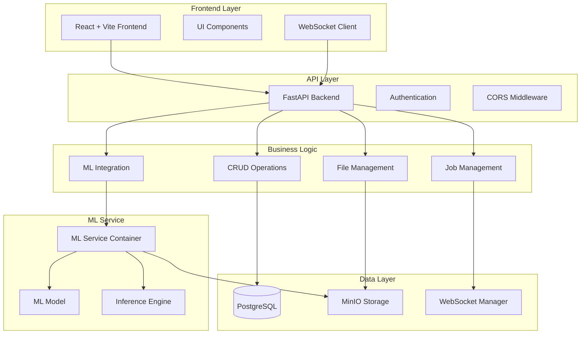

# Архитектура системы LCT_2025

## Обзор системы

LCT_2025 — это современная система для анализа медицинских изображений с использованием машинного обучения. Система построена на микросервисной архитектуре и включает в себя веб-интерфейс, REST API, сервис машинного обучения и хранилище данных.

## Общая архитектура

## Компоненты системы

### 1. Frontend (React + Vite)
- **Технологии**: React 19, TypeScript, Vite, Tailwind CSS
- **Основные функции**:
  - Загрузка и просмотр медицинских изображений
  - 3D визуализация DICOM данных
  - Управление заданиями и результатами анализа
  - Аутентификация пользователей
  - WebSocket подключения для real-time обновлений

### 2. Backend (FastAPI)
- **Технологии**: Python 3.11, FastAPI, SQLAlchemy, Uvicorn
- **Основные функции**:
  - REST API для всех операций
  - Управление пользователями и аутентификация
  - Обработка файлов и заданий
  - Интеграция с ML сервисом
  - WebSocket сервер для real-time обновлений

### 3. База данных (PostgreSQL)
- **Версия**: PostgreSQL 15
- **Основные таблицы**:
  - `users` - пользователи системы
  - `jobs` - задания на анализ
- **Особенности**: UUID для заданий, временные метки, связи между таблицами

### 4. Хранилище файлов (MinIO)
- **Тип**: S3-совместимое объектное хранилище
- **Функции**:
  - Хранение загруженных файлов
  - Хранение результатов анализа
  - Presigned URL для безопасного доступа
  - Поддержка ZIP архивов

### 5. ML Сервис
- **Тип**: Отдельный Docker контейнер
- **Функции**:
  - Обработка медицинских изображений
  - Выполнение ML моделей
  - Возврат результатов анализа
  - Интеграция с MinIO для файлов

## Потоки данных

### 1. Загрузка и анализ файлов
1. Пользователь загружает файл через frontend
2. Frontend отправляет файл на backend через REST API
3. Backend сохраняет файл в MinIO
4. Backend создает задание в PostgreSQL
5. Backend отправляет задание в ML сервис
6. ML сервис обрабатывает файл и возвращает результаты
7. Backend сохраняет результаты в базе данных
8. Frontend получает обновления через WebSocket

### 2. Аутентификация
1. Пользователь вводит учетные данные
2. Frontend отправляет запрос на `/auth/login`
3. Backend проверяет учетные данные в PostgreSQL
4. Backend возвращает JWT токен
5. Frontend сохраняет токен и использует для авторизованных запросов

### 3. Просмотр результатов
1. Пользователь выбирает задание
2. Frontend запрашивает данные задания через REST API
3. Backend возвращает метаданные из PostgreSQL
4. Frontend запрашивает файлы из MinIO через presigned URL
5. Frontend отображает результаты анализа

## Безопасность

### Аутентификация и авторизация
- JWT токены для аутентификации
- PBKDF2-SHA256 для хеширования паролей
- Проверка токенов на каждом защищенном эндпоинте

### Безопасность файлов
- Presigned URL для временного доступа к файлам
- Валидация типов файлов
- Проверка размера файлов

### CORS и сетевые настройки
- Настроенный CORS для cross-origin запросов
- WebSocket поддержка для real-time обновлений
- Прокси настройки для API запросов

## Масштабируемость

### Горизонтальное масштабирование
- Backend может быть развернут в нескольких экземплярах
- MinIO поддерживает кластеризацию
- PostgreSQL поддерживает репликацию

### Вертикальное масштабирование
- Настройка ресурсов для каждого контейнера
- Оптимизация запросов к базе данных
- Кэширование часто используемых данных

## Мониторинг и логирование

### Логирование
- Структурированные логи в JSON формате
- Логирование всех операций с файлами
- Логирование ошибок и исключений

### Мониторинг
- Health check эндпоинты
- Мониторинг состояния сервисов
- WebSocket подключения для real-time статуса

## Развертывание

### Docker Compose
- Все сервисы контейнеризованы
- Автоматическое создание сетей и томов
- Health checks для зависимостей

### Переменные окружения
- Конфигурация через environment variables
- Отдельные настройки для каждого сервиса
- Безопасное хранение секретов

## Технологический стек

### Frontend
- React 19.1.1
- TypeScript 5.8.3
- Vite (rolldown-vite 7.1.12)
- Tailwind CSS 4.1.13
- Cornerstone.js для DICOM
- Zustand для state management

### Backend
- Python 3.11
- FastAPI
- SQLAlchemy
- Uvicorn
- MinIO Python SDK
- Passlib для аутентификации

### Инфраструктура
- Docker & Docker Compose
- PostgreSQL 15
- MinIO (S3-совместимое хранилище)
- Nginx (опционально для production)
